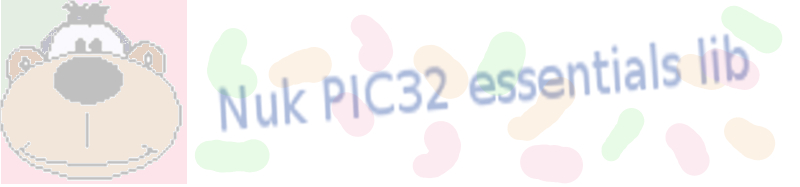

------------------------------------------------------------------------------


------------------------------------------------------------------------------
### **`Clase I2c`**


------------------------------------------------------------------------------

### Descripción


------------------------------------------------------------------------------

</A><A href="#TOP">Top</A> | [Index](Index.md)

Los objetos de la clase **I2c** gestionan los canales de comunicaciones **I2C** 
del MCU, tanto en modo **master**, como en modo **slave**.
  
Se operan con: 
* **Constructores** 
	* [**I2c**(I2Cx, unsigned int *velocidad* [, unsigned char *dir_escavo*, char (*\*callback*)(I2c\*) ] )](#C01)
* **Métodos en modo master** 
	* [void **transmit**(char *direccion*, char* *cadena1* [, int *size1*, char* *cadena2*, int *size2* ] )](#M00)
* **Métodos en modo slave** 
	* [int **get**(char* *cadena*)](#G01)
	* [bool **get**(char* *cadena* ,int *size*)](#G02)
	* [char **get_char**()](#G03)
	* [bool **get_line**(char* *cadena*)](#G04)
	* [void **put**(const char* *cadena*)](#P01)
	* [void **put**(char* *cadena*, unsigned int *size*)](#P02)
	* [void **put_char**(char *byte*)](#P03)
	* [void **put_line**(const char* *cadena*)](#P04)
* **Funciones** 
	* [void **funcion_de_callback**(I2c\*)](#F01)

Véase el [ejemplo](#E01) para tener una noción de cómo funcionan los 
objectos de esta clase.


------------------------------------------------------------------------------

### Constructores


------------------------------------------------------------------------------
<A name="C01"></A>

[Top](#TOP) | [Index](Index.md)

```C
I2c(I2Cx,unsigned int velocidad,unsigned char dirección_escavo,char (*callback)(I2c*))
```

**Descripción**
>Asocia el objecto a un puerto **I2C** del MCU.
Si sólo se definen los parámetros *puerto* y *velocidad*, el módulo 
funcionará en modo **master**; si además se define el parámetro 
*dirección_slave*, el módulo podrá funcionar en modo **master** y/o 
**slave**.

**Parámetros**
>I2C*n*
>>Donde *n* es el número de puerto **I2C** a gestionar. 
Para saber qué puertos están disponible en cada MCU, véase 
[Machines](Machines.h.md#Machines)
> 
>unsigned int *velocidad*
>>Velocidad del puerto. Debe ser alguno de estos valores:
>>* I2C_100K (100.000 baudios) 
>>* I2C_400K (400.000 baudios, el más frecuente)
>>* I2C_1M (1.000.000 baudios)
> 
>unsigned char *dirección_slave*
>>Opcional. Dirección del dispositivo en modo **slave**. Si se define, el 
módulo podrá funcionar en modo **slave**, lo que no impide funcionar en 
modo **master**.
> 
>void (**callback*)(I2c\*)
>>Opconal. Sólo podrá definirse si también se define el parámetro 
*dirección_slave*.
Se aconseja definirla si está prevista la transmisión de datos en modo 
**slave**. 
Si se define, el objeto la invocará cuando sea requerida la transmisión de 
datos por un dispositivo **master** periférico. 
Es decir: Si está previsto que la aplicación en modo **slave** sólo reciba 
datos, no será necesaro definir este parámetro; ya que, en este caso, el objeto 
nunca llegará a invocarla.
La función deberá tener el formato: 
<A href="#F01">void *mi_funcion_de_callback*(I2c\*)</A>..

**Retorno**
>void


------------------------------------------------------------------------------

### Métodos


------------------------------------------------------------------------------
<A name="M00"></A>

[Top](#TOP) | [Index](Index.md)

```C
void transmit(char direccion,char* cadena1 [, int size1, char* cadena2, int size2 ])
```

**Descripción**
>Transmite y recibe en modo **master** cadenas de mesajes, respectivamente 
hacia y desde, el dispositivo **slave** periféfico con la dirección 
especificada.

**Parámetros**
>char *dirección*
>>Dirección del dispositivo periférico.
> 
>char* *cadena1*
>>bytes a transmitir.
> 
>int *size1*
>>Cantidad de bytes a transmitir de la *cadena1*.
> 
>char* *cadena2*
>>Opcional. bytes a recibir, que deberá tener suficiente espacio para 
albergarlos.
> 
>int *size2*
>>Obligado sólo si se ha definido *cadena2*. Cantidad de bytes a recibir.

**Retorno**
>void

**Ejemplo**
>El siguiente código declara un objeto asociado al puerto I2C2 funcionando en 
modo **master** a 400K baudios. En cada iteración de *loop*() se transmiten 
2 bytes a un dipositivo **slave** periférico con la dirección 0x7A, y se 
reciben 6 bytes de él. Seguidamente se transmiten 4 bytes sin esperar respuesta.

```C
//----------------------------------------------
#include "Config_40.h"
#include "Nuk_pic32_essentials.h"

//----------------------------------------------
I2c i2c(I2C3,I2C_400K);

//----------------------------------------------
void
loop(void) {

	char recibe[7];

	i2c.transmit(0x7A,"ab",2,recibe,6);

	...
	...

	i2c.transmit(0x7A,"1234",4);

	...
	...

	return;
	}

//----------------------------------------------
int
main(int argc, char** argv) {

	while(true) loop();

	return 0;
	}

```


------------------------------------------------------------------------------
<A name="G01"></A>

[Top](#TOP) | [Index](Index.md)

```C
int get(const char* cadena)
```

>**Descripción**
>>En modo **slave**, lee todos los bytes recibidos.

>**Parámetros**
>>const char* *cadena*
>>> Cadena terminada en *NULL*, que deberá tener el tamaño suficiente para 
albergar los bytes recibidos.

>**Retorno**
>>int size
>>> Cantidad de bytes leídos.


------------------------------------------------------------------------------
<A name="G02"></A>

[Top](#TOP) | [Index](Index.md)

```C
bool get(const char* cadena, int size)
```

>**Descripción**
>>En modo **slave**, si los hay, lee tantos bytes como los especificados en 
*size*.

>**Parámetros**
>>const char* *cadena*
>>> Puntero a la *cadena* que deberá tener, como mínimo, *size* más uno bytes 
de espacio.

>> int *size*
>>> Cantidad de bytes a extraer.

>**Retorno**
>>bool
>>>**true** Habían suficientes bytes y la cadena ha sido completada.
>>>
>>>**false** No hay suficientes bytes. El contenido de la cadena es 
invalido.


-------------------------------------------------------------------------------
<A name="G03"></A>

[Top](#TOP) | [Index](Index.md)

```C
char get_char()
```

>**Descripción**
>>En modo **slave**, si lo hay, lee un byte.

>**Parámetros**
>>void

>**Retorno**
>>char
>>> Si lo hay, el byte leido.
>>> Si no lo hay 0 (cero).


------------------------------------------------------------------------------
<A name="G04"></A>

[Top](#TOP) | [Index](Index.md)

```C
bool get_line(char* cadena)
```

>**Descripción**
>>En modo **slave**, lee los bytes pendientes hasta encontrar un final 
de linea (*EOL*). Si *EOL* no está entre los bytes pendientes por leer, 
la función devuelve **false** y el contenido de la *cadena* será invalido.

>**Parámetros**
>>char* cadena
>>>Cadena receptora de los bytes. En la cadena, *EOL* será sustituido por 
*NULL*.

>**Retorno**
>>bool
>>> **true** si se ha extraido algún byte;
>>> **false** en caso contrario.

>**Nota**
>> Observa que, aun cuando pudieran haber bytes pendientes, estos no serán 
devueltos por el método si no se ha encontrado un *EOL*.


------------------------------------------------------------------------------
<A name="P01"></A>

[Top](#TOP) | [Index](Index.md)

```C
void put(const char* cadena)
```

**Descripción**
>En modo **slave**, transmite la cadena terminada en *NULL* pasada en el 
parámetro.
 
**Parámetros**
>const char* *cadena*
>> Cadena de bytes terminada en *NULL*.
 
**Retorno**
>void


------------------------------------------------------------------------------
<A name="P02"></A>

[Top](#TOP) | [Index](Index.md)

```C
void put(char* cadena,unsigned int size)
```

**Descripción**
>En modo **slave**, transmite el número de bytes especificado en *size* 
de la *cadena*.
 
**Parámetros**
>const char* *cadena*
>> Cadena de bytes.
> 
>unsigned int *size*
>> Número de bytes a transmitir
 
**Retorno**
>void


------------------------------------------------------------------------------
<A name="P03"></A>

[Top](#TOP) | [Index](Index.md)

```C
void put_char(char byte)
```

**Descripción**
>En modo **slave**, transmite el *byte* especificado.

**Parámetros**
>const char *byte*
>> *byte* a trnasmitir.

**Retorno**
>void


------------------------------------------------------------------------------
<A name="P04"></A>

[Top](#TOP) | [Index](Index.md)

```C
void put_line(const char* cadena)
```

**Descripción**
>Transmite la cadena terminada en cero pasada en el parámetro, y añade a la 
transmisión un byte de fin de linea (*EOL*).

**Parámetros**
>const char* *cadena*
>> Cadena de bytes terminada en 0 (cero).

**Retorno**
>void

**Nota**
> Por omisión el byte *EOL* es 0x0A; sin embargo, puede cambiarse 
modificando la constante definida en el fichero 
[Definitions.h](Definitions.h.md)


------------------------------------------------------------------------------
<A name="P05"></A>

[Top](#TOP) | [Index](Index.md)

```C
void put_hex(const char* cadena, int size)
```

**Descripción**
>Transmite en formato hexadecimal, tantos bytes como se indique en 
*size*, de la cadena pasada en el parámetro, y añade a la transmisión un 
byte de fin de linea (EOL).

**Parámetros**
>const char* *cadena*
>> Cadena de bytes.
> 
>int size
>> Número de bytes a transmitir.

**Retorno**
>void

**Nota**
> Por omisión el byte de fin de línea es 0x0A. Sin embargo puede cambiarse 
modificando la constante definida en el fichero 
[Definitions.h](Definitions.h.md)


------------------------------------------------------------------------------

### Funciones


------------------------------------------------------------------------------
<A name="F01"></A>

[Top](#TOP) | [Index](Index.md)

```C
void funcion_de_callback(I2c* objeto_i2c)
```

**Descripción**
>Si se define en el <A href="#C01">constructor</A>, esta función, que puede 
tomar el nombre que el desarrollador prefiera, será invocada por el objeto 
**I2c** funcionando en modo **slave** cuando un dispositivo periférico 
**master** requiera la transmisión de datos.
>Por lo general, Las taréas de la función son:
>* Leer los bytes de entrada con alguno de los comandos 
<A href="#G01">get</A>.
>* Proporcionar los bytes necesarios de salida con alguno de los comandos 
<A href="#P01">put</A>.

**Parámetros**
>I2c* *objecto_i2c*
>>Es el puntero al objeto **I2c** que ha generado la llamada a la función de 
*callback*.

**Retorno**
>void

**Notas**
>Los métodos <A href="#G01">get</A> y <A href="#P01">put</A> pueden utilizarse 
en cualquier punto del código; no necesariamente en el ámbito de la función de 
*callback*. Tampoco es necesario que la función de *callback* sea invocada para 
poder utilizarlos. Por ejemplo: Si se escribe un interface **slave** que no 
necesita transmitir datos, no tiene sentido implementar la función de 
*callback*, y bastará con utilizar los métodos <A href="#G01">get</A>.
> 
>El objeto invocará a la función de *callback* tantas veces como sea necesario 
hasta completar el número de bytes requeridos para su transmisión. 
Sin embargo, si la función no utiliza ninguno de los métodos 
<A href="#P01">put</A>, el objeto entenderá que se desea transmitir un byte 
*NULL*, que no tantos bytes *NULL* como bytes a transmitir hubieran; 
lo cual significa que el objeto invocará a la función de *callback* tantas 
veces como bytes a transmitir en el caso de que la función de *callback* 
nunca invocara a alguno de los métodos <A href="#P01">put</A>.
> 
>Si la función de *callback* suministra más bytes de los requeridos, el 
objeto utilizará los sobrantes en el próximo requerimiento sin llamar a la 
funcion de *callback*, siempre que estos sean suficientes para atenderlo.
> 
>De todo lo dicho se desprende que la responsabilidad de conocer cuántos 
bytes requeriere el objeto **I2c** en cada momento forma parte del diseño 
correcto del protocolo o de la correcta interpretación de los protocolos 
diseñados por los fabricantes de dispositivos con interfaz **I2c**.
> 
<A name="E01"></A>
**Ejemplo**
>Las dos piezas de cógigo siguientes ilustran una implementación sencilla de 
sendos objetos de la clase **I2c**. La primera pieza corresponde al código del 
MCU que funcionará en modo **master**. La segunda al código del MCU que 
funcionará en modo **slave**.
> 
>Cada código declara un objeto **I2c** asociado al puerto **I2C** de su 
repectivo MCU (También se declaran los objetos para la gestión del puerto serie 
en cada MCU, cuya explicación está fuera del alcance de este ejemplo. 
Véase [Clases Serial, Serial_Tx y Serial_Rx](Serial.md)).
> 
>El MCU **master**, en cada iteración de *loop()*, espera a recibir una cadena 
de bytes por el puerto serie. 
De éstos, envía tres por el puerto **I2C** y espera la recepción de otros tres. 
(Para simplificar el ejemplo, se asume que por el puerto serie se recibirán 
siempre, como mínimo, tres bytes)
> 
>El MCU **slave** recibe los tres bytes envíados por el **master**, y después 
de enviarlos por el puerto serie, los transforma en mayúsculas. 
El resultado lo envía por el puerto **I2C** al MCU **master**.
> 
>El MCU **master** recibe los tres bytes esperados y los envía por el 
puerto serie.
> 
>Nótese que la función *main()* del MCU **slave** lo único que hace es dormir. 
Será el objeto **I2c** quien despierte al MCU para ejecutar la función 
*on_i2c()*, que es la de *callback* en este ejemplo.

```C
//----------------------------------------------
// master.cpp

//----------------------------------------------
#include "Config_40.h"
#include "Nuk_pic32_essentials.h"


//----------------------------------------------
Serial serial(UART2,500000);
I2c i2c(I2C2,I2C_400K);

//----------------------------------------------
void
loop() {

	char tr[255];
	char rc[255];

	// Se esperan, como mínimo, tres bytes del puerto serie
	serial.put("Tres minusculas: ");
	while( !serial.get_line(tr) );

	// Los transmitimos por I2C y esperamos la recepción de otros tres
	i2c.transmit(0x7A,tr,3,rc,3);

	// Enviamos por el puerto serie los tres bytes recibidos
	rc[3] = 0;
	serial.put("En mayusculas: ");
	serial.put_line(rc);

	return;
	}

//----------------------------------------------
int
main(int argc, char** argv) {

	while(true) loop();

	return 0;
	}

```

```C
//----------------------------------------------
// slave.cpp

//----------------------------------------------
#include "Config_40.h"
#include "Nuk_pic32_essentials.h"

//----------------------------------------------
Serial serial(UART2,500000);
I2c i2c(I2C2,I2C_400K,0x7A,on_i2c);

//----------------------------------------------
void
on_i2c(void) {

	char rc[4];
	int i;

	// Recuperamos los bytes pendientes de leer y
	// los enviamos por el puerto serie
	i2c.get(rc);
	serial.put("Recibido de master: ");
	serial.put_line(rc);

	// Transformamos las minusculas en mayusculas
	for(i=0;i<3;i++)
		if( (rc[i]>96) && (rc[i]<123) )
			rc[i] -= 32;

	// Enviamos el resultado por el puerto I2C
	i2c.put(rc,3);
	return;
	}

//----------------------------------------------
int
main(int argc, char**Loop argv) {

	while(true) sleep();

	return 0;
	}
```


[Top](#TOP) | [Index](Index.md)


